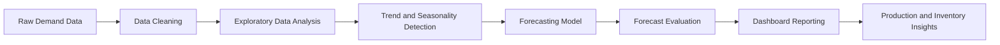
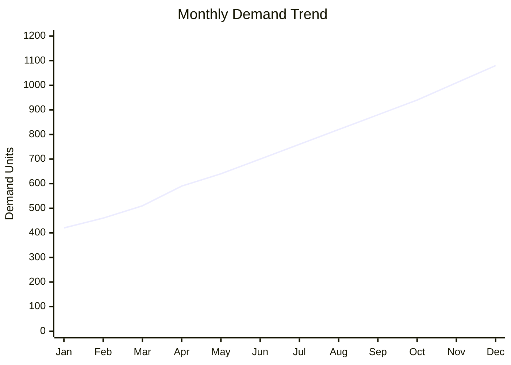
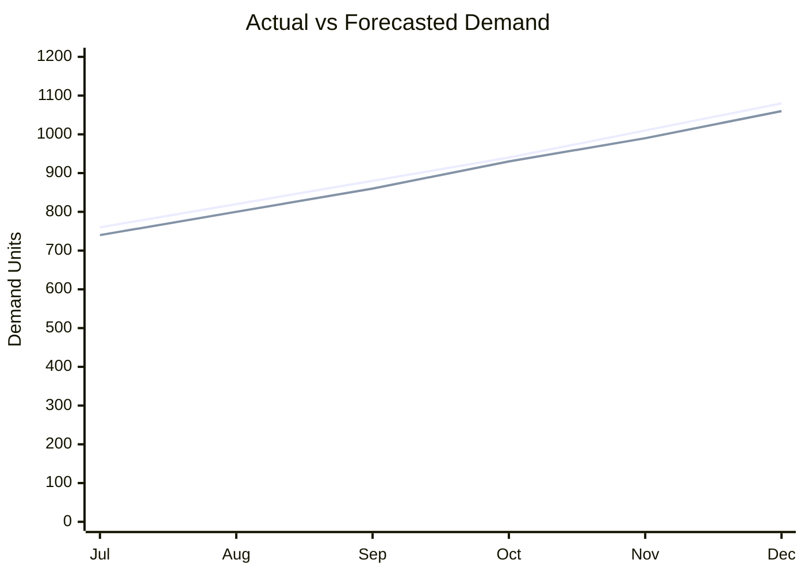
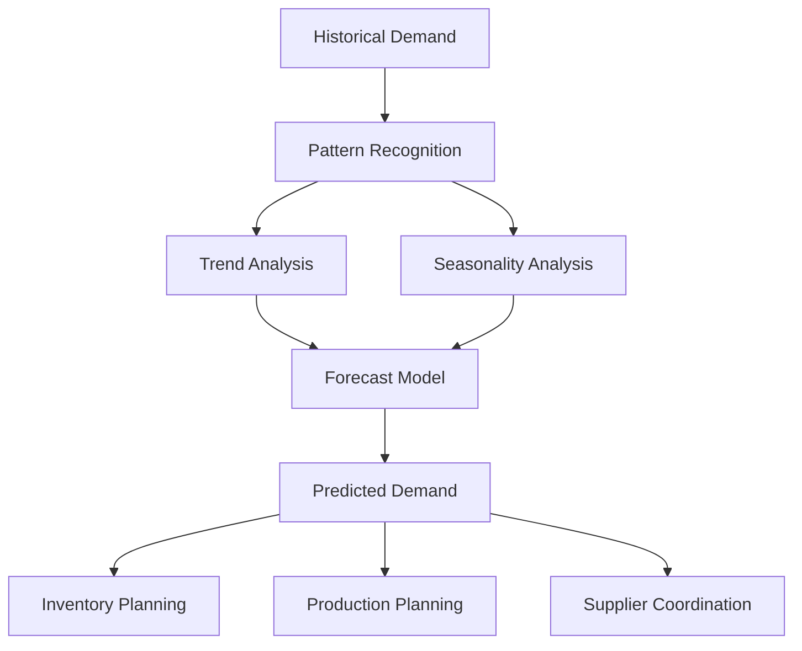

<div align="center">

# Automotive Demand Forecasting Dashboard

### Yazaki / Mercedes-Benz Supply Chain Forecasting Case Study

<br>


<br><br>


<br><br>


</div>

---

## Project Overview

This project is a professional **automotive demand forecasting and data analytics case study** inspired by supply-chain and production-planning scenarios in a **Yazaki / Mercedes-Benz automotive environment**.

The objective is to analyze historical demand data, identify demand patterns, detect trends and seasonality, and generate reliable forecasts that support better decisions in:

- Production planning  
- Inventory control  
- Supplier coordination  
- Material availability  
- Operational performance  

In automotive manufacturing, poor forecasting can lead to **material shortages, overstock, delayed production, unstable planning, and higher operational costs**.  
This project shows how Python-based analytics can turn raw demand data into clear, visual, and business-ready forecasting insights.

---

## Business Problem

Automotive suppliers need accurate demand visibility to make sure the right components are available at the right time.

Demand can change because of:

- Customer orders  
- Production schedules  
- Seasonal demand behavior  
- Delivery priorities  
- Market fluctuations  
- Supplier and logistics constraints  

This project focuses on answering key business questions:

- How does demand develop over time?
- Which months show high or low demand?
- Are there visible trends or seasonal patterns?
- What future demand can be expected?
- How can forecasting improve production and inventory planning?
- How can visual reporting support faster operational decisions?

---

## Forecasting Workflow



The workflow follows a complete analytics process:

1. Import and structure demand data  
2. Clean missing, duplicated, or inconsistent values  
3. Analyze historical demand behavior  
4. Visualize trends and seasonality  
5. Build forecasting models  
6. Compare actual demand with predicted demand  
7. Evaluate forecast accuracy  
8. Present insights through dashboard-style reporting  

---

## Key Features

| Area | Description |
|---|---|
| Data Preparation | Cleaning, formatting, and preparing demand data |
| Demand Analysis | Historical demand investigation and pattern recognition |
| Forecasting | Future demand prediction using time-series logic |
| KPI Reporting | Business metrics for planning and performance tracking |
| Visual Analytics | Charts and dashboard-style insights |
| Business Interpretation | Translating data results into operational decisions |

---

## Dashboard & Visual Analytics

### Monthly Demand Trend



### Actual vs Forecasted Demand



### Forecasting Logic



### Business Impact Flow


---

## KPI Overview

| KPI | Purpose |
|---|---|
| Total Demand | Measures overall component demand volume |
| Average Monthly Demand | Shows the baseline demand level |
| Demand Growth | Identifies increasing or decreasing demand |
| Forecast Accuracy | Measures prediction quality |
| Forecast Error | Highlights model deviation |
| Peak Demand Period | Supports capacity and resource planning |
| Low Demand Period | Supports inventory optimization |

---

## Business Value

This project demonstrates how data-driven forecasting can support automotive production and supply-chain operations.

Potential business impact:

- Better demand visibility  
- Improved production planning  
- Reduced risk of material shortages  
- Lower inventory waste  
- More accurate supplier coordination  
- Faster operational decision-making  
- Clearer communication between data, production, and business teams  
- Stronger planning for future component requirements  

For an automotive supplier environment connected to Mercedes-Benz production scenarios, this type of forecasting can help align component availability with expected demand and production schedules.

---

## Technologies Used

| Category | Tools |
|---|---|
| Programming | Python |
| Data Analysis | Pandas, NumPy |
| Visualization | Matplotlib, Seaborn |
| Forecasting | Time-Series Analysis, Scikit-learn |
| Environment | Jupyter Notebook |
| Data Handling | CSV, Excel |
| Reporting | Business Intelligence Dashboard Logic |

---

## Repository Structure

```text
YAZAKI/
│
├── assets/
│   ├── Mercedes_Benz.jpg
│   └── Yazaki Logo.png
│
├── data/
│   └── demand_data.csv
│
├── notebooks/
│   └── forecasting_analysis.ipynb
│
├── src/
│   └── forecasting_model.py
│
├── README.md
└── requirements.txt
```

---

## Skills Demonstrated

- Automotive demand forecasting  
- Supply-chain analytics  
- Python data analysis  
- Data cleaning and preprocessing  
- Exploratory data analysis  
- Time-series analysis  
- Forecast visualization  
- KPI reporting  
- Dashboard storytelling  
- Business intelligence  
- Operational data analysis  
- Technical documentation  

---

## Project Outcome

The final result is a complete forecasting and reporting workflow that transforms historical demand data into actionable insights.

The project shows how analytics can support automotive operations by helping teams understand demand behavior, anticipate future requirements, and improve production and inventory planning.

---

## Disclaimer

This project is an educational and portfolio case study. Yazaki and Mercedes-Benz names, logos, and trademarks belong to their respective owners. This repository is not an official product of Yazaki or Mercedes-Benz.

---

<div align="center">

## Author

**Hani Mohamed Salah**  
IT Operations & Data Analytics  
Berlin, Germany  

GitHub: [hany69x](https://github.com/hany69x)

</div>
